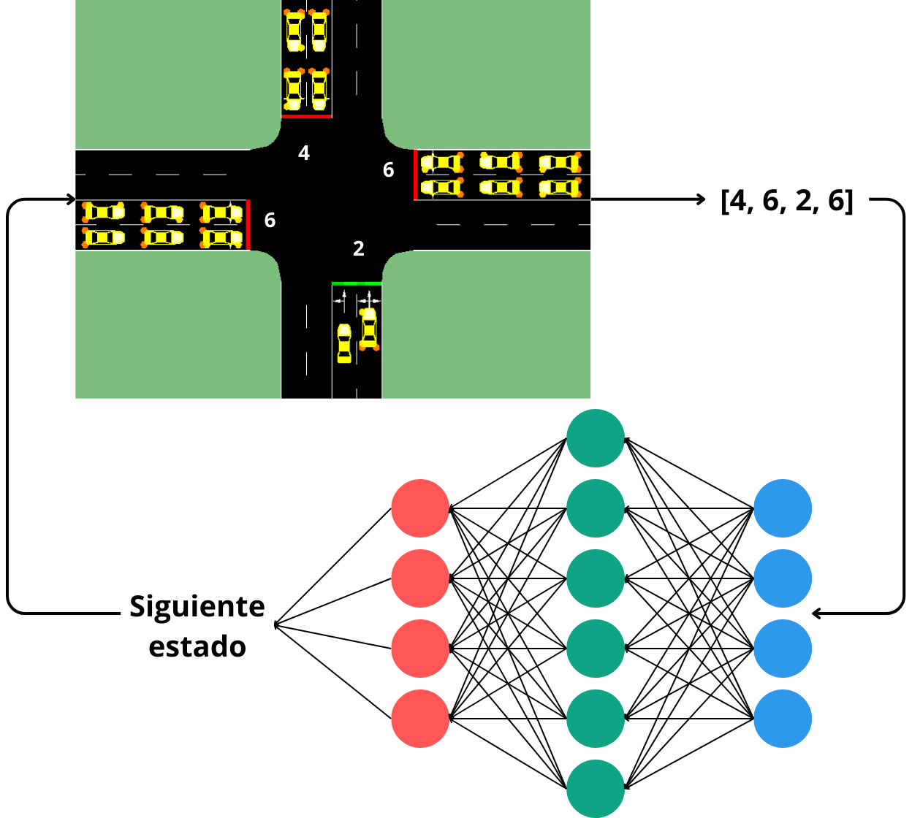

# Dynamic-State-Traffic-Lights
This project presents a proposal to implement a dynamic state traffic light system, which adapts to conditions in real time to optimize the trafic flow.

[This video](https://youtu.be/caAPAvuc0jY) shows a comparison between our trained model and a conventional traffic light system.


## Instalation
In order to try our model, a basic installation of SUMO is needed (see SUMO oficial installation). Moreover, the Traffic Control Interface and SUMO python libraries must be installed to. You can install these libraries using pip:
```bash
pip install traci
```
```bash
pip install sumolib
```
Then, clone this repository:
```bash
git clone git@github.com:daniel-lima-lopez/Dynamic-State-Traffic-Lights.git
```
Move to the instalation folder
```bash
cd Dynamic-State-Traffic-Lights
```

## Method description
The proposed method consists of a traffic light system whose states are controlled by a neural network, which receives as input the number of cars in each lane and predic the most next optimal state, as desribed in the next figure:


Regarding the neural network training, genetic algorithms are used to optimize the weights configuration. In this approach, the genetic algorithm seeks to minimize the time needed to handle a defined traffic flow. In this way, the algorithm optimizes the neural network configuration to control traffic appropriately.

## Examples
To run the simulations presented in the video, you first need to move to [Simulations](Simulations) folder:
```bash
cd Simulations
```
The file [sim_base.py](Simulations/sim_base.py) execute a simulation with a conventional traffic lights system. The file [sim_nn.py](Simulations/sim_nn.py) execute a simulation with the same triffic configurations and the proposed method with a previously tranied neural networks, whose weight configuration is in the file [optimo.txt](Simulations/optimo.txt).

To train the model from scratch, from the installation folder, move to [Traning](Traning) folder:
```bash
cd Training
```
The file [genetico.py](Training/genetico.py) contains the traning routine which produces the optimal weight configuration ([optimo.txt](Training/optimo.txt)). It should be considered that the training process takes approximately 6 hours.
